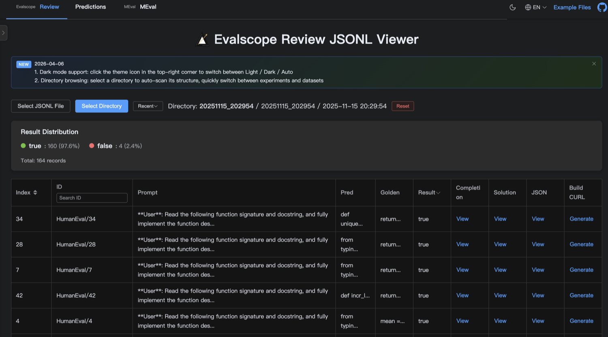
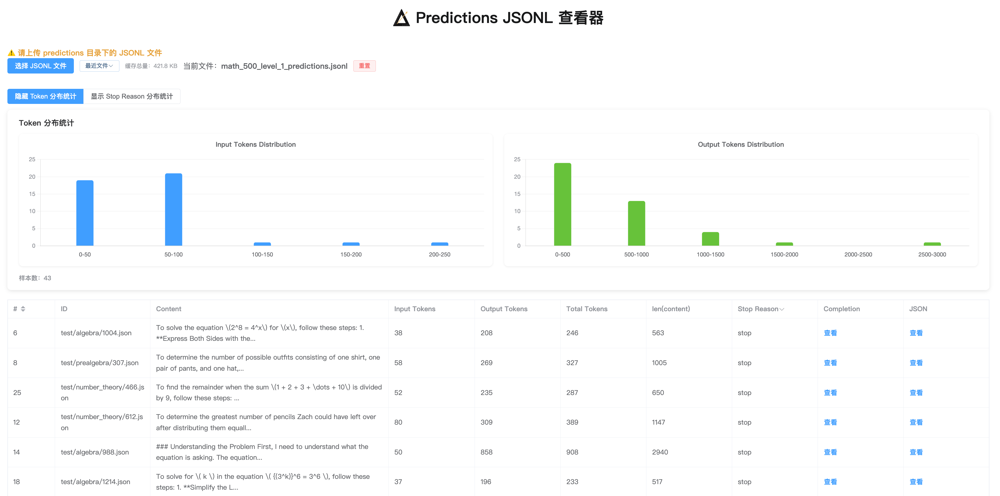

# LLM Eval Viewer

[English](README.md)

**LLM Eval Viewer** 是一个用于 **大模型评测结果可视化** 的轻量网页工具，  
目前支持 **evalscope** 生成的评测结果格式。

**在线体验：**  
https://dynamicheart.github.io/llm-eval-viewer/

---

## 功能特性

- **多视图支持**：Predictions、Reviews 和 MEval 样本查看器
- **目录浏览**：选择目录自动扫描结构，快速切换不同实验和数据集（Chrome/Edge）
- **Token 分布**：直方图展示，含平均 Prompt/Output Token 统计
- **结果分布**：可交互的分布图表，点击可快速筛选
- **Reasoning 支持**：展示推理内容，标记为 [R]，可分别查看 Text 和 Reasoning
- **国际化**：支持中英文切换
- **样例数据**：首次使用可加载内置样例数据，快速体验功能

---

## 示例文件（evalscope）

你可以直接使用以下示例文件进行本地或在线体验：

- **Predictions**
  - [math_500_level_1_predictions.jsonl](https://raw.githubusercontent.com/dynamicheart/llm-eval-viewer/main/docs/examples/math_500_level_1_predictions.jsonl)
- **Reviews**
  - [math_500_level_1_reviews.jsonl](https://raw.githubusercontent.com/dynamicheart/llm-eval-viewer/main/docs/examples/math_500_level_1_reviews.jsonl)

- **Predictions（带 reasoning）**
  - [humaneval_predictions_with_reasoning.jsonl](https://raw.githubusercontent.com/dynamicheart/llm-eval-viewer/main/docs/examples/humaneval_predictions_with_reasoning.jsonl)
- **Reviews（带 reasoning）**
  - [humaneval_reviews_with_reasoning.jsonl](https://raw.githubusercontent.com/dynamicheart/llm-eval-viewer/main/docs/examples/humaneval_reviews_with_reasoning.jsonl)

---

## 效果预览

### Reviews View


### Predictions View


---

## 开发

```bash
cd llm-eval-viewer
npm install
npm run dev
```

## 构建

```bash
npm run build
```

## 许可证

MIT
